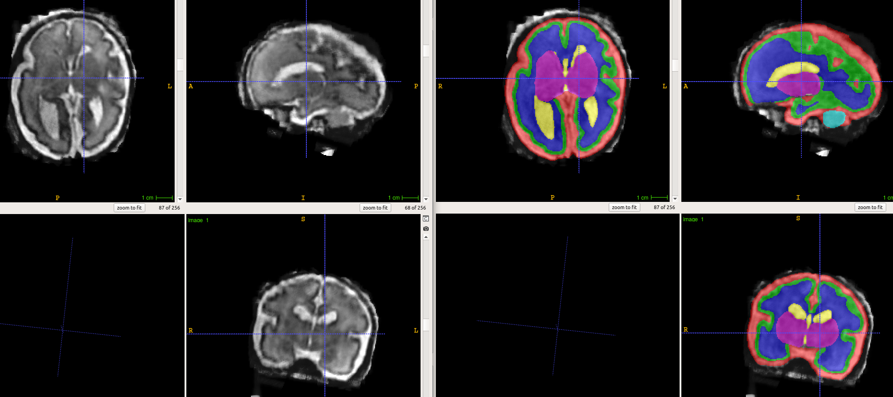
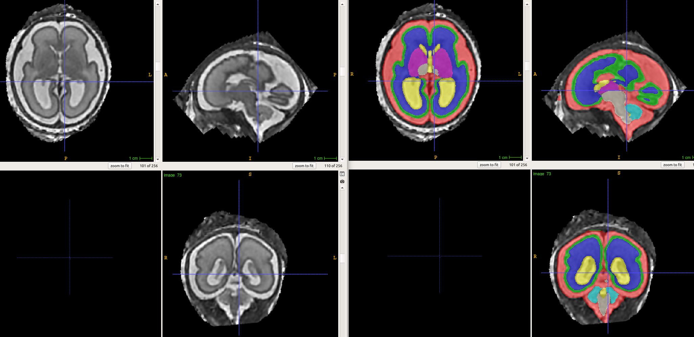

# Fetal brain tissue  segmentation in T2-weighted MRI

This model was developed using the data provided as part of Fetal Brain Tissue Annotation and Segmentation Challenge (FeTA), MICCAI 2021.

https://feta-2021.grand-challenge.org/

The model is based on a deep fully convolutional neural network. It was developed at IMAGINE laboratory of Harvard Medical School  (https://imagine.med.harvard.edu/).

Massive image and label augmentation were used to train the model. 

For obtaining the training code, plase contact Davood Karimi at  davood.karimi@childrens.harvard.edu.

## How to run the model on your images

docker pull davoodk/fetal_brain_segmentation

docker run   --mount src=IMAGE_DIR,target=/src/test_images/,type=bind  davoodk/fetal_brain_segmentation

## Results:

The following show example results on the images from FeTA Challenge.

  

  

